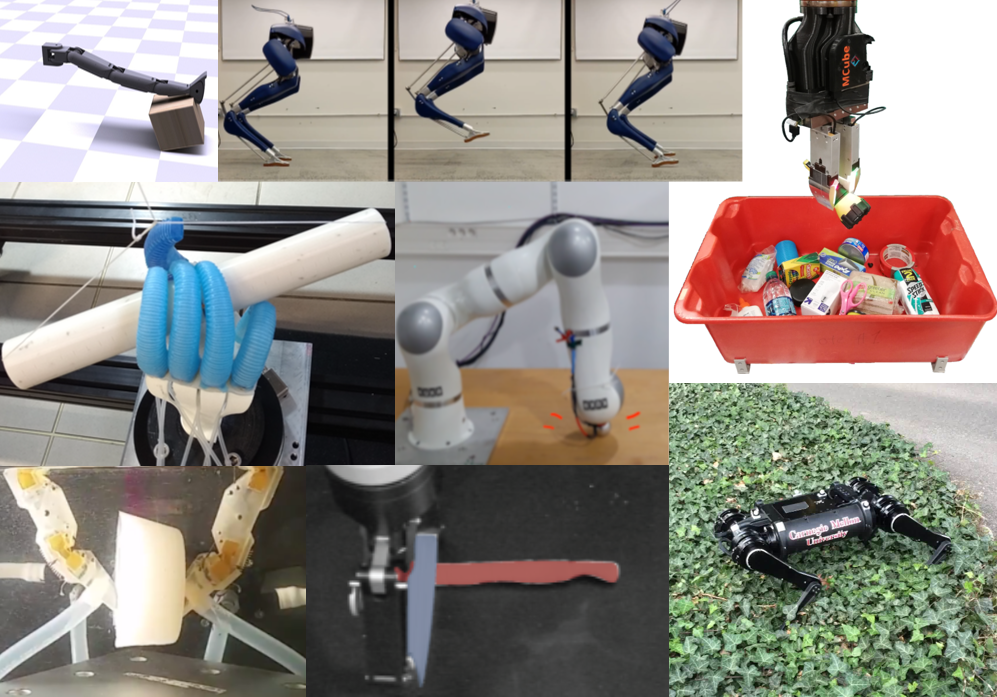

### Workshop at Robotics: Science and Systems 2022

## Description
Handling contact is a fundamental challenge in robotics. We want robots to interact with the world to do
something useful, which often requires physical interaction with the environment. Whether it is a warehouse
arm picking an object from a box, a search and rescue robot walking over broken terrain, or a home assistance
robot clearing the dishes, robots need to be able to enable, plan for, control through, sense, withstand, and
learn about contact events. However, contact necessarily involves a sudden change in dynamics – the effects
of motion while touching and almost touching can differ dramatically. Because of this, many robots seek to
avoid or minimize the effects of contact, for example by slowing down before touching an object. Furthermore,
robots go through great lengths to avoid unexpected contacts, by operating in controlled environments or
taking excessively conservative paths around obstacles.

This workshop seeks to push the field toward a future where robots aren’t afraid of contact. Where
accidentally bumping into something isn’t catastrophic, and where the robot doesn’t treat everything in the
environment as if it were made of egg shells. To get there, we need to reason about contact while considering
all aspects of the system design: the mechanism, sensing, control, planning, and learning must all account for
the challenges of real-world contact. This is also an issue that cuts across different application domains such
as manipulation or locomotion. Thus this workshop is designed to bring together researchers from across
the robotics field to explore new approaches to tackling this fundamental challenge.

[RSS 2022 Conference Webstite](https://roboticsconference.org/)

## Invited Speakers
We are excited to have an incredible group of invited speakers from a range of research backgrounds who are all excited to share their thoughts on this theme:

* [Pulkit Agrawal](https://people.csail.mit.edu/pulkitag/), Assistant Professor, Massachusetts Institute of Technology
* [Maria Bauza](https://web.mit.edu/bauza/www/), Ph.D. Candidate, Massachusetts Institute of Technology
* [Ken Goldberg](https://goldberg.berkeley.edu/), Professor, University of California, Berkeley
* [Yan Gu](https://www.uml.edu/engineering/mechanical/faculty/gu-yan.aspx), Assistant Professor, University of Massachusetts, Lowell
* [Kevin Lynch](https://robotics.northwestern.edu/people/profiles/faculty/lynch-kevin.html), Professor, Northwestern University
* [Zachary Manchester](https://www.ri.cmu.edu/ri-faculty/zachary-manchester/), Assistant Professor, Carnegie Mellon University
* [Carolyn Matl](https://carolyncmatl.github.io/), Research Scientist, Toyota Research Institute
* [Francesca Negrello](https://scholar.google.com/citations?user=pRTUzT4AAAAJ&hl=en), Postdoc, Istituto Italiano di Tecnologia
* [Alessandro Saccon](https://www.tue.nl/en/research/researchers/alessandro-saccon/), Assistant Professor, Eindhoven University of Technology

## Call for Contributions

We will solicit contributed abstracts for presentation at the workshop. Check back here for details.

## Schedule

Subject to change.

|Introduction & Welcome | 8:45-9:00 |
|Invited Talks 1, 2, & 3 | 9:00-10:00 |
|Posters and coffee break | 10:00-10:50 |
|Invited Talk 4 | 10:50-11:10 |
|Accepted Talk 1 | 11:10-11:30 |
|Panel Discussion 1 | 11:30-12:00 |
|Lunch | 12:00-1:30 |
|Accepted Talks 2 & 3 | 1:30-2:10 |
|Invited Talks 5 & 6 | 2:10-2:50 |
|Posters and coffee break | 2:50-3:30 |
|Invited Talks 7, 8, & 9 | 3:30-4:30 |
|Panel Discussion 2 | 4:30-5:00 |
 
## Organizers

* [Aaron M. Johnson](https://www.andrew.cmu.edu/user/amj1/), Carnegie Mellon University
* [Michael Posa](https://www.grasp.upenn.edu/people/michael-posa/), University of Pennsylvania
* [Hannah Stuart](https://edg.berkeley.edu/people/hannah-stuart/), University of California, Berkeley
